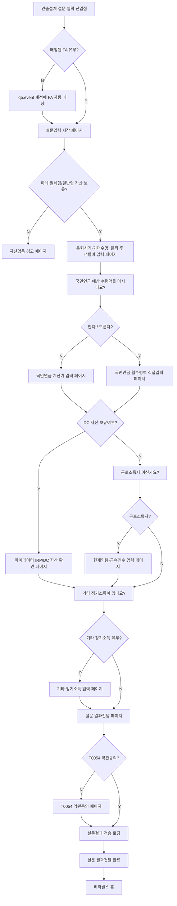

# 앱-기획자 컨텍스트

작성일: 2026-03-05
최종 업데이트: 2026-03-09
담당: 앱-기획자

---

## 역할

BetterWealth 모바일 앱의 기획을 담당한다.
화면 플로우, 제약사항, 입력 스펙을 정의하고 Figma 코멘트로 관리한다.

---

## Figma 파일 정보

- 기획 작업 파일: mgyo_note (AioSbUjrVBRnqTpFsltOC5)
- 실제 디자인 파일: 0DVyXyoWEbXXNOZF0H92Ic (node-id=7264-866) ← 플로우차트 및 제약사항 기준
- DS 파일: wygEtCwUqQJ9p06qsDnBJF (수정 금지 — 별도 오너 관리)

---

## 작업 이력

### #1114 인출설계: App: 인출설계 설문지

Figma 캔버스: node-id=77-733

#### 확정된 플로우 (2026-03-09 최종)

변경 이력:
- 2026-03-05: 초안 확정 (이어가기 플로우 포함)
- 2026-03-09: 피드백 반영
  - FA 미매칭 → 경고 페이지 **삭제** → qb.event 계정 자동 매칭으로 변경
  - 이어가기/재진입 플로우 **전면 삭제** (P11 페이지 제거)
  - 진입점 노출 여부 판단 로직 **삭제**
  - 은퇴시기·기대수명 + 은퇴 후 생활비 → **단일 페이지로 통합**

```
[진입] 인출설계 설문 입력 진입점
    ↓
[?] 매칭된 FA 유무 Y/N
    ├─ N → qb.event 계정에 FA 자동 매칭
    │           ↓ (합류)
    └─ Y → 설문입력 시작 페이지
               ↓
           [?] 마데 절세형/일반형 자산 보유 Y/N  ← 백엔드 판단
               ├─ N → 자산없음 경고 페이지
               └─ Y → 은퇴시기·기대수명, 은퇴 후 생활비 입력 페이지 (통합)
                           ↓
                       국민연금 예상 수령액을 아시나요? 페이지
                           ↓
                       [?] 안다 / 모른다 Y/N
                           ├─ 모른다 → 국민연금 계산기 입력 페이지
                           └─ 안다   → 국민연금 월수령액 직접입력 페이지
                                           ↓ (합류)
                                       [?] DC 자산 보유여부 Y/N  ← 백엔드 판단
                                           ├─ Y → 마이데이터 IRP/DC 자산 확인 페이지
                                           │           ↓
                                           └─ N → 근로소득자 이신가요? 페이지
                                                       ↓
                                                   [?] 근로소득자 Y/N
                                                       ├─ Y → 현재연봉·근속연수 입력 페이지
                                                       │           ↓ (합류)
                                                       └─ N → 기타 정기소득이 있나요? 페이지
                                                                   ↓
                                                           [?] 기타 정기소득 유무 Y/N
                                                               ├─ Y → 기타 정기소득 입력 페이지
                                                               │           ↓ (합류)
                                                               └─ N → 설문 결과전달 페이지
                                                                           ↓
                                                                   [?] T0054 약관동의 Y/N
                                                                       ├─ N → T0054 약관동의 페이지
                                                                       │           ↓ (합류)
                                                                       └─ Y → 설문결과 전송 로딩 페이지
                                                                                   ↓
                                                                               설문 결과전달 완료 페이지
                                                                                   ↓
                                                                               베러웰스 홈 페이지
```

Mermaid (기준 플로우):


#### 페이지별 제약사항 (Figma 코멘트 기준 — 파일: 0DVyXyoWEbXXNOZF0H92Ic)

| 페이지 | Node ID | 코멘트 ID | 주요 내용 |
|--------|---------|-----------|----------|
| 마데 절세형/일반형 자산 보유 Y/N | 7262:1660 | 1664396097 | 백엔드 판단 기준 (mainClassCode/middleClassCode/minorClassCode 조합), ⚠️ 앱 계좌 타입 별도 확인 필요 |
| 은퇴시기·기대수명 + 은퇴 후 생활비 입력 (통합) | 7262:1662 | 1664396673 | 은퇴시기: 디폴트 65세, 셀렉트박스(55/60/65/70세) / 기대수명: 디폴트 100세, **셀렉트박스** (현재나이+1~100세) / 월 희망 소비액: 단위 만원 |
| 국민연금 계산기 입력 페이지 | 7262:1668 | 1664397177 | **연소득**: 세전/만원/디폴트없음, 최초가입시기: 연+월, 예상납입종료: 만 60세 자동입력 |
| 국민연금 월수령액 직접입력 페이지 | 7262:1669 | 1664397392 | 세전, 단위 만원 |
| DC 자산 보유여부 확인 Y/N | 7262:1654 | 1664397562 | 백엔드 판단: (INV, PNS, DC_) 자산 존재 여부, ⚠️ 앱 계좌 타입 별도 확인 필요 |
| 현재연봉·근속연수 입력 페이지 | 7262:1677 | 1664397956 | 현재연봉: 세전/만원, **국민연금 계산기 경로면 P6 입력 연소득 디폴트(수정가능)**, 직접입력 경로면 디폴트없음 / 근속연수: 입사일 기준 만(滿) 연수 |
| 기타 정기소득 입력 페이지 | 7262:1641 | 1664398710 | 연소득(세전), 옵셔널, 시작시기 디폴트=은퇴시기 / 종료시기 디폴트=기대수명 (백엔드 처리) |
| 설문 결과전달 페이지 (답변 수정) | 7262:1640 | 1664398937 | 수정 항목 클릭 → 해당 입력 페이지 이동 → 수정 후 다음 클릭 → 결과 확인 페이지로 복귀 |
| T0054 약관동의 | 7262:1635 | 1664399141 | FA 매칭 고객은 웹 FA 매칭 시 약관 이미 수신 → 동의 Y 상태임 |

#### DB형 퇴직금 계산식 (Figma 코멘트 — 확정 대기)

```
퇴직금 = 일 평균임금 × 30일 × 근속연수
일 평균임금 = (퇴직 전 연봉 / 12 × 3) ÷ 90일
퇴직 전 연봉 = 현재연봉 × (1 + 물가상승률)^(퇴직연도 - 현재연도)  (물가상승률 3% 가정)
```

※ 산식 문구는 담당자 확정 후 반영 예정

#### 미확인 사항 (별도 확인 필요)

- 마이데이터 절세형/일반형 자산 기준 — 앱 기준 계좌 타입 확인 필요
- DC 자산 보유여부 기준 — 앱 기준 계좌 타입 확인 필요

#### 삭제된 플로우 (2026-03-09)

- ~~이어가기/재진입 플로우~~ — 제거됨
- ~~P11 이어하기 선택 페이지~~ — 제거됨
- ~~진입점 노출 여부 판단 (완료 설문 숨김)~~ — 제거됨
- ~~FA 없음 경고 페이지~~ — qb.event 자동 매칭으로 대체

---

### Figma 플러그인 스케치 작업 이력 (#1114)

#### 플러그인 파일 위치

레포: `figma-plugin/survey/` (git 관리)
- `manifest.json` — 플러그인 메타 (name: BetterWealth 인출설계 설문지)
- `code.js` — 메인 로직 (buildPage1,3~16 + buildFlowchart)
- `ui.html` — 플러그인 UI (페이지 스케치 탭 + 플로우차트 탭)

#### 구현된 화면 목록 (최신 기준)

| 번호 | 화면 | 스텝 | 비고 |
|------|------|------|------|
| P1 | 설문 시작 | - | 시작하기 CTA |
| ~~P2~~ | ~~FA 자동 매칭 안내~~ | - | **제거됨** — 내부 처리로 UI 불필요 |
| P3 | 자산없음 경고 | - | 마데 자산 없을 때만 노출 |
| P4 | 은퇴시기·기대수명·생활비 통합 | 1/8 | 은퇴시기 셀렉트박스(55/60/65/70세), 기대수명 **셀렉트박스**(현재나이+1~100세), 생활비 324만원 디폴트 |
| P5 | 국민연금 Y/N | 2/8 | ChoiceCard 선택 |
| P6 | 국민연금 계산기 | 3/8 | **연소득**(세전/만원/디폴트없음), 가입시기(연+월), 납입종료(readonly, 은퇴시기 연동) |
| P7 | 국민연금 직접입력 | 3/8 | 세전 월수령액, 단위 만원 |
| P8 | IRP/DC 자산 확인 | 4/8 | DC 보유 시만 노출, 카드 리스트 |
| P9 | 근로소득자 여부 | 5/8 | ChoiceCard |
| P10 | 연봉·근속연수 | 6/8 | 연봉: P6 계산기 경로면 P6 입력값 디폴트/직접입력 경로면 디폴트없음 / 근속연수: 현재 재직 회사 기준 만(滿) 연수 |
| P11 | 기타 정기소득 여부 | 7/8 | ChoiceCard |
| P12 | 기타 정기소득 입력 | 7/8 | 연소득(세전) 단일 입력 / 시작시기=은퇴시기 연동(readonly), 종료시기=기대수명 연동(readonly) / 소득유형 미표시 |
| P13 | 설문 결과 확인 | 8/8 | 요약 리스트 + 수정 버튼 / 근로소득자 아닌 경우 근로소득 행 미표시, DC 없으면 퇴직연금 행 미표시 |
| P14 | T0054 약관동의 | - | 전체동의 + 필수3 + 선택1 |
| P15 | 전송 로딩 | - | 스피너 중앙 |
| P16 | 전달 완료 | - | "담당 FA가 확인 후 맞춤 인출 전략을 안내해 드릴 예정이에요." |

#### 수정 이력

- 2026-03-09: 최초 구현 (16개 화면, 플로우차트 포함)
- 2026-03-09: P2 제거 (내부 처리로 변경), P16 문구 수정
- 2026-03-09: P4 기대수명 → 셀렉트박스 (Figma 코멘트 기준)
- 2026-03-09: P6 입력 단위 월소득 → 연소득 (Figma 코멘트 기준)
- 2026-03-09: P10 근속연수 헬퍼 텍스트 추가 (현재 재직 회사 기준 명시)
- 2026-03-09: P10 서브헤더 확정 — "입력한 연봉과 근속연수를 바탕으로 퇴직금을 예상해 드려요."
- 2026-03-09: P12 시작/종료시기 readonly 연동 기준 각각 명시
- 2026-03-09: P12 소득유형 제거, 다건 입력 → 단일 입력으로 변경 (추가하기 버튼 제거)
- 2026-03-09: P15 로딩 문구 — "회원님의 은퇴 후 30년을 준비하고 있어요" (BIZ 목표 30년 반영)
- 2026-03-09: P16 완료 화면 리디자인 — 임팩트 박스 "은퇴 후 30년, 준비된 인출 전략이 노후를 지켜줍니다."

#### BIZ 컨셉 — 아웃트로 감동 설계

- **목표**: 인출설계 완료 시 고객 감동 + 인출설계 필요성 각인
- **키워드**: "은퇴 후 30년" (BIZ팀 인출전략 목표 기간)
- **적용 범위**: P15(로딩), P16(완료)만 적용 — P1(진입)은 진입 장벽을 낮추는 톤 유지
- **P15→P16 감정선**: "30년을 준비하고 있어요" → "첫 걸음을 내딛으셨어요" → "은퇴 후 30년, 준비된 인출 전략이 노후를 지켜줍니다."

#### 사용자 테스트 결과 요약

| 차수 | Major | Minor | 주요 변경 |
|------|-------|-------|---------|
| 1차 | 4 | 3 | — |
| 2차 | 1 | 3 | P2 제거, P16 문구 수정, 기대수명 수정 가능 |
| 3차 | 0 | 1 | P10/P12 헬퍼 텍스트 추가, P6 연소득 단위 통일 |
| 4차 | 0 | 0 | P4 기대수명 셀렉트박스, P6 레이블 수정 |
| 5차 | 0 | 0 | P10 문구 확정, P15/P16 아웃트로 리디자인 |

**5차 테스트 기준 전 이슈 해소 ✓**
