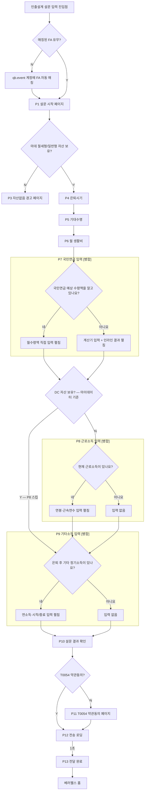

# #943 인출설계 설문지 — 스펙 문서

> **✅ 이 문서는 사용자가 직접 소통하고 수정할 수 있는 유일한 파일입니다.**  
> 다른 모든 문서는 Claude가 관리하므로 직접 수정하지 마세요.


이슈: #943 (앱 이슈 #1114 연동)
작성일: 2026-03-05
최종 업데이트: 2026-03-11
담당팀: 앱팀

---

## 추가 작업 — 예시 문구 반영 (2026-03-10)

상태: **스펙확정**

출처: 사업팀 제공 프로토타입 (`retirement-survey-web(0207).html`)
> ⚠️ 프로토타입의 플로우는 현재 기획과 다름 — **문구만** 참고

### 적용 범위: 화면별 추가 문구

#### P1 — 설문 시작

| 위치 | 문구 |
|------|------|
| 서브헤더 (기존 없음 → 추가) | "편안한 은퇴를 위한 맞춤 설계를 시작합니다" |

---

#### P4 — 은퇴시기 입력 (1/10)

| 위치 | 문구 |
|------|------|
| 서브헤더 (기존 없음 → 추가) | "은퇴 시점과 기대수명에 따라 필요한 자산 규모와 준비 전략이 달라집니다" |
| 은퇴시기 셀렉트박스 아래 헬퍼 | "일반적인 은퇴 시기: 60~65세 / 국민연금은 65세부터 감액 없이 수령 가능" |

---

#### P5 — 기대수명 입력 (2/10)

| 위치 | 문구 |
|------|------|
| 기대수명 셀렉트박스 아래 헬퍼 | "평균 기대수명 남성 81세, 여성 87세 / 평균보다 5~10년 길게 설정 권장" |

---

#### P6 — 은퇴후 생활비 입력 (3/10)

| 위치 | 문구 |
|------|------|
| 생활비 입력 아래 헬퍼 | "현재 생활비의 70~80% 수준 / 기본 200~300만원 · 중간 300~500만원 · 여유 500~800만원" |

---

#### P8 — 국민연금 계산기 (5/10)

| 위치 | 문구 |
|------|------|
| 서브헤더 (기존 없음 → 추가) | "은퇴 후 받으실 국민연금을 계산해드릴게요" |

---

#### P9 — 국민연금 직접입력 (5/10)

| 위치 | 문구 |
|------|------|
| 서브헤더 (기존 없음 → 추가) | "예상 국민연금 월 수령액을 알려주세요" |

---

#### P12 — 기타 정기소득 질문 + 입력 [병합] (7/8)

| 위치 | 문구 |
|------|------|
| 서브헤더 (기존 없음 → 추가) | "은퇴 후 정기적으로 받으실 소득을 알려주세요" |
| 연소득 입력 아래 헬퍼 | "월세, 임대 수입, 배당금 등 근로소득 외 정기적으로 받는 소득의 연간 합계" |

---

#### P16 — 전달 완료

| 위치 | 문구 |
|------|------|
| 임팩트 박스 아래 (추가) | "입력하신 정보를 바탕으로 맞춤 은퇴 설계 리포트를 준비하겠습니다" |

---

### 미확인 / 미합의 사항

| 질문 | 답변 | 상태 |
|------|------|------|
| P1 서브헤더 위치: 메인 타이틀 아래? | 메인 타이틀 바로 아래 | 확정 |
| 기대수명 헬퍼텍스트가 길어서 2줄 처리 필요 — 줄임 허용? | 핵심만 줄여서 처리 | 확정 |

---

## 이슈 개요

**목적**: 고객이 인출설계를 위한 기본 정보를 설문 형태로 입력하고, FA에게 전달하는 설문지 플로우 구현

**Figma 파일**
- 디자인 파일: `0DVyXyoWEbXXNOZF0H92Ic` (node-id=7264-866) ← 플로우차트 및 제약사항 기준
- 기획 캔버스: node-id=77-733

**관련 파일**
- 플러그인: `issues/feature/943/figma-plugin/`
- 결과 문서: `issues/feature/943/943results.md`
- 사용자 테스트: `issues/feature/943/943user_test_results.xlsx`

---

## 확정된 플로우 (2026-03-09 최종)

### 변경 이력
- 2026-03-05: 초안 확정 (이어가기 플로우 포함)
- 2026-03-09: 피드백 반영
  - FA 미매칭 → 경고 페이지 **삭제** → qb.event 계정 자동 매칭으로 변경
  - 이어가기/재진입 플로우 **전면 삭제** (구 P11 이어하기 페이지 제거)
  - 진입점 노출 여부 판단 로직 **삭제**
  - 은퇴시기·기대수명 + 은퇴 후 생활비 → **단일 페이지로 통합**
- 2026-03-11: 플로우 수정
  - P4 단일 페이지 → **3개 페이지로 분리** (P4 은퇴시기 / P5 기대수명 / P6 생활비)
  - DC 자산 보유(Y) 경로: IRP/DC 확인 후 **근로소득자 질문 스킵** → 기타소득 직행
  - 전체 페이지 번호 P4 이후 +2 시프트 (P5→P7, P6→P8 … P16→P18), 총 17개 화면
  - P11+P12 병합 (근로소득자 Y/N + 연봉/근속연수 → 단일 화면), P13+P14 병합 (기타소득 Y/N + 입력 → 단일 화면)
  - 병합으로 P15→P13, P16→P14, P17→P15, P18→P16, 총 15개 화면 (P1, P3~P16)
  - 프로그레스 바: 10칸 세그먼트 → 연속형 바 (숫자 텍스트 없음, 바만 표시)

### 텍스트 플로우

```
[진입] 인출설계 설문 입력 진입점
    ↓
[?] 매칭된 FA 유무 Y/N
    ├─ N → qb.event 계정에 FA 자동 매칭
    │           ↓ (합류)
    └─ Y → 설문입력 시작 페이지 (P1)
               ↓
           [?] 마데 절세형/일반형 자산 보유 Y/N  ← 백엔드 판단
               ├─ N → 자산없음 경고 페이지 (P3)
               └─ Y → 은퇴시기 입력 페이지 (P4)
                           ↓
                       기대수명 입력 페이지 (P5)
                           ↓
                       은퇴후 생활비 입력 페이지 (P6)
                           ↓
                       국민연금 Y/N + 입력 [병합] (P7)
                           │  "네, 알고 있어요" → 월수령액 직접입력 펼침
                           │  "아니요, 계산해 볼게요" → 계산기 필드 펼침 → 계산하기 → 인라인 결과
                           ↓
                       [?] DC 자산 보유 Y/N  ← 마이데이터 기준
                           ├─ Y (P8 스킵) ──────────────────────────┐
                           └─ N → 근로소득자 Y/N + 연봉/근속연수 [병합] (P8)
                                      │  "네" → 연봉/근속연수 입력 영역 펼침  │
                                      │  "아니요" → 입력 없이 진행             │
                                      ↓ ◄────────────────────────────────────┘
                           │  "네" → 연봉/근속연수 입력 영역 펼침
                           │  "아니요" → 입력 없이 진행
                           ↓
                       기타소득 Y/N + 입력 [병합] (P9)
                           │  "네" → 연소득/시작시기/종료시기 펼침
                           │  "아니요" → 입력 없이 진행
                           ↓
                       설문 결과확인 (P10)
                           ↓
                       [?] T0054 약관동의 Y/N
                           ├─ N → T0054 약관동의 (P11)
                           │           ↓ (합류)
                           └─ Y → 설문결과 전송 로딩 (P12)
                                       ↓
                                   설문 결과전달 완료 (P13)
                                       ↓
                                   베러웰스 홈
```

### Mermaid



---

## 화면별 입력 스펙 및 제약사항

### Figma 코멘트 기준 (파일: 0DVyXyoWEbXXNOZF0H92Ic)

| 화면 | Node ID | 코멘트 ID | 주요 제약사항 |
|------|---------|-----------|-------------|
| P3. 마데 자산 보유 판단 | 7262:1660 | 1664396097 | 백엔드 판단 기준 (mainClassCode/middleClassCode/minorClassCode 조합), ⚠️ 앱 계좌 타입 별도 확인 필요 |
| P4. 은퇴시기 입력 | 7262:1662 | 1664396673 | 디폴트 65세, 셀렉트박스(55/60/65/70세) |
| P5. 기대수명 입력 | 7262:1662 | 1664396673 | 디폴트 100세, 셀렉트박스(현재나이+1~100세) |
| P6. 은퇴후 생활비 입력 | 7262:1662 | 1664396673 | 월 희망 소비액, 단위 만원, 디폴트 324만원 |
| P7. 국민연금 Y/N + 입력 [병합] | 7262:1668 | 1664397177 | "네"→월수령액 직접입력 펼침(세전/만원), "아니요"→계산기(연소득+최초가입시기+납입종료) + 인라인 결과 카드 / 납입종료: 은퇴시기 연동(readonly) / 계산하기 완료 후 "다음" CTA 활성화 |
| P8. 근로소득자 Y/N + 연봉·근속연수 [병합] | 7262:1677 | 1664397956 | Y 선택 시 연봉/근속연수 입력 영역 펼침. 연봉: 세전/만원, P7 계산기 경로면 P7 연소득 디폴트(수정가능) / 직접입력 경로면 디폴트없음 / 근속연수: 현재 재직 회사 기준 만(滿) 연수 |
| P9. 기타소득 Y/N + 입력 [병합] | 7262:1641 | 1664398710 | Y 선택 시 소득 입력 영역 펼침. 연소득(세전) 단일 입력, 소득유형 미표시, 시작시기=은퇴시기(readonly), 종료시기=기대수명(readonly) |
| P10. 설문 결과 확인 | 7262:1640 | 1664398937 | 수정 항목 클릭 → 해당 입력 페이지 이동 → 수정 후 다음 클릭 → 결과 확인 페이지로 복귀 |
| P11. T0054 약관동의 | 7262:1635 | 1664399141 | FA 매칭 고객은 웹 FA 매칭 시 약관 이미 수신 → 동의 Y 상태 |

### DB형 퇴직금 계산식

```
퇴직금 = 일 평균임금 × 30일 × 근속연수
일 평균임금 = (퇴직 전 연봉 / 12 × 3) ÷ 90일
퇴직 전 연봉 = 현재연봉 × (1 + 물가상승률)^(퇴직연도 - 현재연도)  (물가상승률 3% 가정)
```

P10 노출 문구: "입력한 연봉과 근속연수를 바탕으로 퇴직금을 예상해 드려요."

### BIZ 컨셉 — 아웃트로 감동 설계

- **목표**: 인출설계 완료 시 고객 감동 + 인출설계 필요성 각인
- **키워드**: "은퇴 후 30년" (BIZ팀 인출전략 목표 기간)
- **적용 범위**: P12(로딩), P13(완료)만 적용 — P1(진입)은 진입 장벽을 낮추는 톤 유지
- **감정선**: "30년을 준비하고 있어요" → "첫 걸음을 내딛으셨어요" → "은퇴 후 30년, 준비된 인출 전략이 노후를 지켜줍니다."

---

## 미확인 사항

- 마이데이터 절세형/일반형 자산 기준 — 앱 기준 계좌 타입 확인 필요
- DC 자산 보유여부 기준 — 앱 기준 계좌 타입 확인 필요

---

## 삭제된 플로우 이력

- ~~이어가기/재진입 플로우~~ — 제거됨 (2026-03-09)
- ~~P2 FA 자동 매칭 안내 페이지~~ — 내부 처리로 변경, UI 불필요 (2026-03-09)
- ~~P11 이어하기 선택 페이지~~ — 제거됨 (2026-03-09)
- ~~진입점 노출 여부 판단 로직~~ — 제거됨 (2026-03-09)
- ~~FA 없음 경고 페이지~~ — qb.event 자동 매칭으로 대체 (2026-03-09)

---

## 변경 이력

| 날짜 | 내용 |
|------|------|
| 2026-03-05 | 초안 확정 |
| 2026-03-09 | 플로우 대폭 수정 (이어가기 삭제, P2 제거, P4 통합 등) |
| 2026-03-10 | app_planner_context.md에서 이슈 폴더로 이관 |
| 2026-03-11 | P4 분리 (은퇴시기/기대수명/생활비 → 3개), DC=Y 경로 근로소득자 스킵, P번호 전면 재정렬 (총 17개) |
| 2026-03-11 | P11+P12 병합 (근로소득자+연봉/근속연수), P13+P14 병합 (기타소득 Y/N+입력), P번호 재정렬 (총 15개, P1·P3~P16), 프로그레스 바 → 연속형 8단계 (N/8 텍스트) |
| 2026-03-11 | P7+P8+P9 병합 → 단일 P7 (국민연금 Y/N + 직접입력 또는 계산기 + 인라인 결과), P10(IRP/DC 자산 확인) 제거, P11→P8, P12→P9, P13→P10, P14→P11, P15→P12, P16→P13, 총 12개 페이지 (P1·P3~P13) |
| 2026-03-11 | DC 분기 재도입: DC=Y → P8(근로소득) 스킵 후 P9 직행 (마이데이터 기준 자동 분기) |
| 2026-03-11 | 프로그레스 바 step 숫자 텍스트 제거 — 바만 표시 (분기에 따라 총 단계 수가 달라져 혼란 방지) |
| 2026-03-11 | 전송 로딩 2.5초 → 1초 |
