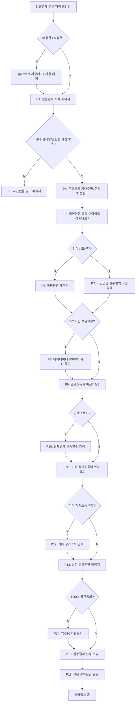

# #943 인출설계 설문지 — 스펙 문서

이슈: #943 (앱 이슈 #1114 연동)
작성일: 2026-03-05
최종 업데이트: 2026-03-10
담당팀: 앱팀

---

## 이슈 개요

**목적**: 고객이 인출설계를 위한 기본 정보를 설문 형태로 입력하고, FA에게 전달하는 설문지 플로우 구현

**Figma 파일**
- 디자인 파일: `0DVyXyoWEbXXNOZF0H92Ic` (node-id=7264-866) ← 플로우차트 및 제약사항 기준
- 기획 캔버스: node-id=77-733

**관련 파일**
- 플러그인: `issues/feature/943/figma-plugin/`
- 결과 문서: `issues/feature/943/943results.md`
- 사용자 테스트: `issues/feature/943/943user_test_results.xlsx`

---

## 확정된 플로우 (2026-03-09 최종)

### 변경 이력
- 2026-03-05: 초안 확정 (이어가기 플로우 포함)
- 2026-03-09: 피드백 반영
  - FA 미매칭 → 경고 페이지 **삭제** → qb.event 계정 자동 매칭으로 변경
  - 이어가기/재진입 플로우 **전면 삭제** (P11 페이지 제거)
  - 진입점 노출 여부 판단 로직 **삭제**
  - 은퇴시기·기대수명 + 은퇴 후 생활비 → **단일 페이지로 통합**

### 텍스트 플로우

```
[진입] 인출설계 설문 입력 진입점
    ↓
[?] 매칭된 FA 유무 Y/N
    ├─ N → qb.event 계정에 FA 자동 매칭
    │           ↓ (합류)
    └─ Y → 설문입력 시작 페이지 (P1)
               ↓
           [?] 마데 절세형/일반형 자산 보유 Y/N  ← 백엔드 판단
               ├─ N → 자산없음 경고 페이지 (P3)
               └─ Y → 은퇴시기·기대수명, 은퇴 후 생활비 입력 페이지 (P4)
                           ↓
                       국민연금 예상 수령액을 아시나요? (P5)
                           ↓
                       [?] 안다 / 모른다 Y/N
                           ├─ 모른다 → 국민연금 계산기 입력 페이지 (P6)
                           └─ 안다   → 국민연금 월수령액 직접입력 페이지 (P7)
                                           ↓ (합류)
                                       [?] DC 자산 보유여부 Y/N  ← 백엔드 판단
                                           ├─ Y → 마이데이터 IRP/DC 자산 확인 페이지 (P8)
                                           │           ↓
                                           └─ N → 근로소득자 이신가요? (P9)
                                                       ↓
                                                   [?] 근로소득자 Y/N
                                                       ├─ Y → 현재연봉·근속연수 입력 페이지 (P10)
                                                       │           ↓ (합류)
                                                       └─ N → 기타 정기소득이 있나요? (P11)
                                                                   ↓
                                                           [?] 기타 정기소득 유무 Y/N
                                                               ├─ Y → 기타 정기소득 입력 페이지 (P12)
                                                               │           ↓ (합류)
                                                               └─ N → 설문 결과전달 페이지 (P13)
                                                                           ↓
                                                                   [?] T0054 약관동의 Y/N
                                                                       ├─ N → T0054 약관동의 페이지 (P14)
                                                                       │           ↓ (합류)
                                                                       └─ Y → 설문결과 전송 로딩 (P15)
                                                                                   ↓
                                                                               설문 결과전달 완료 (P16)
                                                                                   ↓
                                                                               베러웰스 홈
```

### Mermaid



---

## 화면별 입력 스펙 및 제약사항

### Figma 코멘트 기준 (파일: 0DVyXyoWEbXXNOZF0H92Ic)

| 화면 | Node ID | 코멘트 ID | 주요 제약사항 |
|------|---------|-----------|-------------|
| P3. 마데 자산 보유 판단 | 7262:1660 | 1664396097 | 백엔드 판단 기준 (mainClassCode/middleClassCode/minorClassCode 조합), ⚠️ 앱 계좌 타입 별도 확인 필요 |
| P4. 은퇴시기·기대수명·생활비 | 7262:1662 | 1664396673 | 은퇴시기: 디폴트 65세, 셀렉트박스(55/60/65/70세) / 기대수명: 디폴트 100세, 셀렉트박스(현재나이+1~100세) / 월 희망 소비액: 단위 만원, 디폴트 324만원 |
| P6. 국민연금 계산기 | 7262:1668 | 1664397177 | 연소득: 세전/만원/디폴트없음, 최초가입시기: 연+월, 예상납입종료: 만 60세 자동입력(readonly) |
| P7. 국민연금 직접입력 | 7262:1669 | 1664397392 | 세전 월수령액, 단위 만원 |
| P8. DC 자산 보유 판단 | 7262:1654 | 1664397562 | 백엔드 판단: (INV, PNS, DC_) 자산 존재 여부, ⚠️ 앱 계좌 타입 별도 확인 필요 |
| P10. 연봉·근속연수 | 7262:1677 | 1664397956 | 연봉: 세전/만원, P6 계산기 경로면 P6 연소득 디폴트(수정가능) / 직접입력 경로면 디폴트없음 / 근속연수: 현재 재직 회사 기준 만(滿) 연수 |
| P12. 기타 정기소득 입력 | 7262:1641 | 1664398710 | 연소득(세전) 단일 입력, 소득유형 미표시, 시작시기=은퇴시기(readonly), 종료시기=기대수명(readonly) |
| P13. 설문 결과 확인 | 7262:1640 | 1664398937 | 수정 항목 클릭 → 해당 입력 페이지 이동 → 수정 후 다음 클릭 → 결과 확인 페이지로 복귀 |
| P14. T0054 약관동의 | 7262:1635 | 1664399141 | FA 매칭 고객은 웹 FA 매칭 시 약관 이미 수신 → 동의 Y 상태 |

### DB형 퇴직금 계산식

```
퇴직금 = 일 평균임금 × 30일 × 근속연수
일 평균임금 = (퇴직 전 연봉 / 12 × 3) ÷ 90일
퇴직 전 연봉 = 현재연봉 × (1 + 물가상승률)^(퇴직연도 - 현재연도)  (물가상승률 3% 가정)
```

P10 노출 문구: "입력한 연봉과 근속연수를 바탕으로 퇴직금을 예상해 드려요."

### BIZ 컨셉 — 아웃트로 감동 설계

- **목표**: 인출설계 완료 시 고객 감동 + 인출설계 필요성 각인
- **키워드**: "은퇴 후 30년" (BIZ팀 인출전략 목표 기간)
- **적용 범위**: P15(로딩), P16(완료)만 적용 — P1(진입)은 진입 장벽을 낮추는 톤 유지
- **감정선**: "30년을 준비하고 있어요" → "첫 걸음을 내딛으셨어요" → "은퇴 후 30년, 준비된 인출 전략이 노후를 지켜줍니다."

---

## 미확인 사항

- 마이데이터 절세형/일반형 자산 기준 — 앱 기준 계좌 타입 확인 필요
- DC 자산 보유여부 기준 — 앱 기준 계좌 타입 확인 필요

---

## 삭제된 플로우 이력

- ~~이어가기/재진입 플로우~~ — 제거됨 (2026-03-09)
- ~~P2 FA 자동 매칭 안내 페이지~~ — 내부 처리로 변경, UI 불필요 (2026-03-09)
- ~~P11 이어하기 선택 페이지~~ — 제거됨 (2026-03-09)
- ~~진입점 노출 여부 판단 로직~~ — 제거됨 (2026-03-09)
- ~~FA 없음 경고 페이지~~ — qb.event 자동 매칭으로 대체 (2026-03-09)

---

## 변경 이력

| 날짜 | 내용 |
|------|------|
| 2026-03-05 | 초안 확정 |
| 2026-03-09 | 플로우 대폭 수정 (이어가기 삭제, P2 제거, P4 통합 등) |
| 2026-03-10 | app_planner_context.md에서 이슈 폴더로 이관 |
